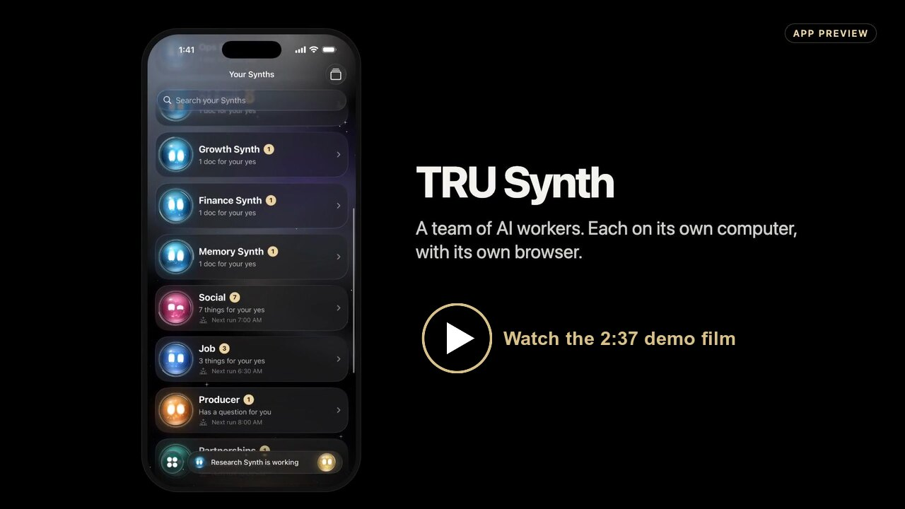

# SYNTH: talk to anyone, your Synths do the follow-through

[](https://live.trusynth.com/record)

**[▶ Watch the 2:31 demo film](https://live.trusynth.com/record)**

You meet someone and say "I'll send you the code tonight". Then the week happens and the follow-up never goes out. Or it goes out late, generic, and wrong about a detail.

SYNTH is a team of AI workers ("Synths"), each on its own computer, that turn a conversation into a checked, approved follow-up. They research the company, write the email, argue about it, bring in a specialist when the content calls for one, and ask the other company's agent to confirm what was agreed. **Nothing is sent until you tap Approve on your phone.**

Watch it live: **https://live.trusynth.com** (the browser wall: every Synth's real browser, streamed while it works).

## What happens in one run

1. **Transcript → Desk.** A conversation transcript comes in (a Plaud recording export, or pasted). Desk's Scribe pulls out the topic, the needs and each commitment ("George: I'll send you the code tonight"), each with the second it was said.
2. **Scout** (on a Vultr VM in San Jose) searches the web in its own browser, opens the pages behind its facts and outlines each fact on the page.
3. **Echo** drafts the email: it quotes one line they said, uses one researched fact, restates every commitment, and links what George promised.
4. **Chief** reviews the draft. It recruits a specialist by what the conversation was about (Pricing, Tech, Legal, Scheduler, FactCheck, or PartnerCheck from another organisation). Any claim without a source or a transcript line is **BLOCKED**, and Echo must fix it.
5. The specialist checks every claim against the sources in its own browser. A found claim is outlined in champagne; a claim that isn't there is marked red.
6. Chief dismisses the specialist and brings in **Counterparty**: the other company's agent, on a *second Band account*, which sees only the commitments. It can change the plan ("Tuesday is full; Wednesday 2:30 PM PT, and include our CTO"). Echo updates the draft, and Chief passes it.
7. **George approves** in the TRU Synth app (or by iMessage or on the web). Only then does Resend send it. Every source, claim, verdict and promise lands in a **Neo4j** graph, so "What did I promise today?" has a traceable answer.

## The TEAM: a startup's worth of Synths, approved in one place

Each Synth proposes a real task as a Review card in the app. George approves it centrally, the Synth does it live in its own browser (the card links to "Watch live"), and it leaves a proof page with sources, screenshots, ids and timestamps.

| Synth | Task it proposes | Proof it leaves |
|---|---|---|
| Deal | The follow-up above | Resend id + graph path |
| Research | "Brief: 3 alternatives to Band for agent rooms" | Each line with its source, the phrase outlined on the page |
| Scheduler | "Hold Wed 2:30 for the Crusoe call" | Free/busy only (never titles) → .ics to George (Resend id) |
| Growth | "Find 5 companies at this conference that fit us" | A list with sources; each intro becomes its own Review card and stays a draft |
| Ops | "Start a demo computer in San Jose for tonight" | Vultr VM id, its live page, the auto-delete time |
| QA | "Check trusynth.com at phone size" | Pages, links and failures, with screenshots at 390 px |
| Finance | "Tonight's burn" | Credits straight from the Crusoe, Vultr and OpenRouter APIs |
| Memory | "What did I promise today?" | Promises from real runs, each with the second it was said |

## Stack, and what would be impossible without each piece

| Sponsor | What it does here | Without it |
|---|---|---|
| **Band** | The room where Synths talk, with @mentions, recruit (add participant) and dismiss. Counterparty is on a second Band account and reachable only as an approved contact. | No shared room across organisations. The "other company's agent" moment can't happen. |
| **Crusoe** | Every Synth thinks on Crusoe: DeepSeek V4 Pro (Chief), V4 Flash (Scout, checkers, Scribe), gpt-oss-120b (Echo, Counterparty), Nemotron (Legal). | Different models per role at speed; one provider bill. |
| **Vultr** | Scout, FactCheck, Scheduler and Counterparty each run on their own VM (sjc, lax) with their own Chromium; Ops starts demo VMs on demand. | "Each Synth has its own computer" would be a claim, not a fact. |
| **Neo4j** | The deal graph: people, runs, sources, claims, verdicts, promises. | No traceable answer to "what did I promise, and when did I say it?" |
| **Plaud** | The recorder whose transcript export starts a run (its transcription runs on the device; we take the export). | Nothing to follow up on. |
| **OpenRouter** | Failover when a Crusoe model is slow or empty, and PartnerCheck's independent model. | One outage stops the room. |
| **Brave** | Search, in the Synths' own browsers. | No fresh facts. |
| **Resend** | The only send, after George's yes. | |

## Honest limits

- **Band free tier:** at most 5 participants per room *including* Desk, and 10 rooms per account with no delete. So Desk keeps Scout, Echo and Chief in, and one rotating seat is used first by the recruited specialist and then by Counterparty. One room is reused across runs, and every message carries a run id and a timestamp so a late message can't leak into another run.
- **Similarweb:** we have no access, so traffic numbers show as "not available" instead of being guessed.
- **Search bot checks:** some search pages ask cloud IPs to prove they're human. The Synths never solve them; they fall back to another engine and say so.
- Browsing is read-only: no sign-ins and no form submits. The only outbound email is the approved one, and team tasks email George only.

## Code map

- `src/server.ts`: Desk (Watcher + Scribe), the run flow, the approval gate, the APIs, the frame streams and the app bridge.
- `src/roles.ts`: Scout, Echo, Chief, the checkers and Counterparty. Each is a worker process (`src/worker.ts`) with its own Band identity, its own workspace and its own browser.
- `src/browser.ts`: each Synth's live browser. Raw CDP, screencast frames streamed to the wall.
- `src/tasks/`: the TEAM runner and executors (`types.ts` is the interface to add a Synth).
- `src/graph/`: the Neo4j deal graph, `/graph`, `/proof`.
- `infra/vultr/`: bringing the VM workers up and down (cloud-init, sync, a reaper at 03:00Z).
- `public/`: the web views (Deal Room, wall, graph, proof).

## Run it

```bash
bun install
PORT=7990 bun src/server.ts              # live if the keys are in the macOS Keychain; MOCK=1 for a local mock room
VM_MODE=vultr PORT=7990 bun src/server.ts  # skip the roles that run on the VMs listed in runs/vms.json
```

Keys are read at runtime from the Keychain (or env on a VM). They are never logged, written or committed.
